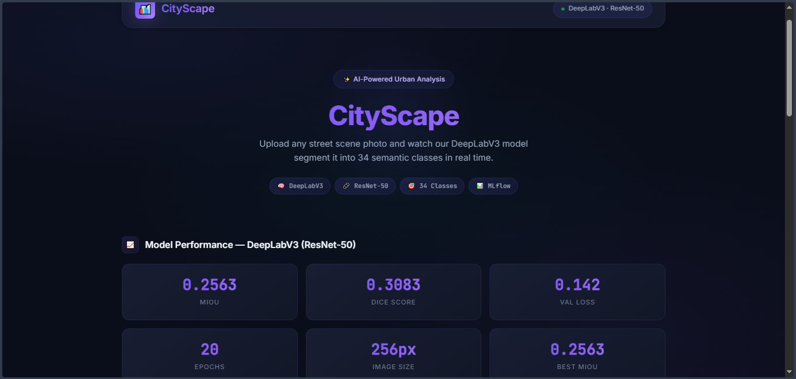
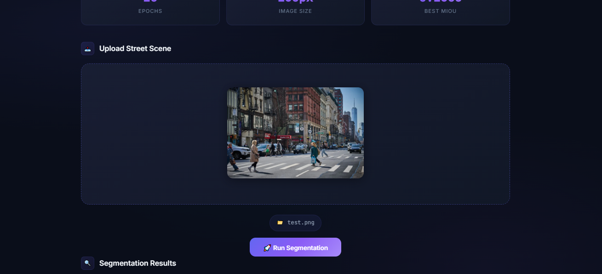
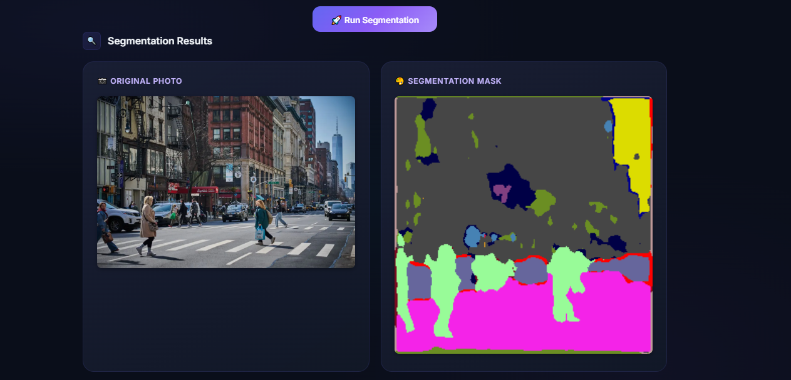
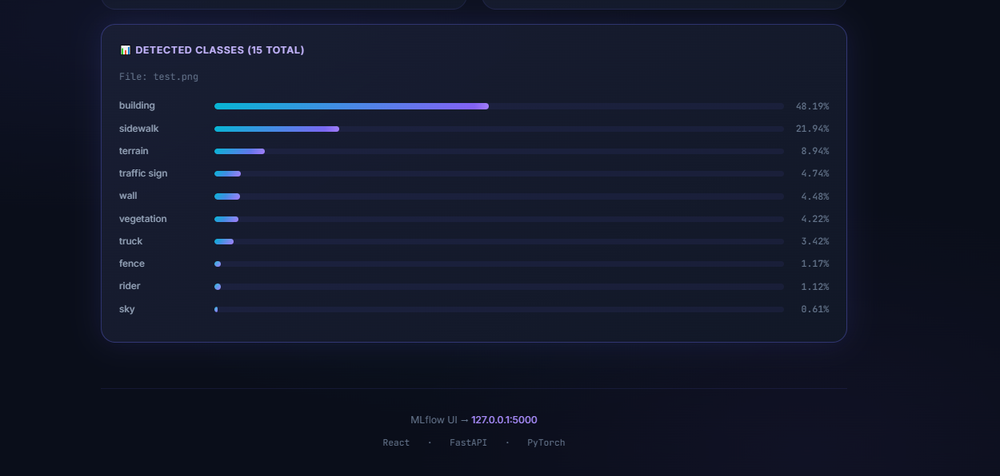

# CityScape — Urban Scene Segmentation

A full-stack AI web application that performs **semantic segmentation** on street scene images using **DeepLabV3+ with an EfficientNet-B3 backbone**, trained on the Cityscapes dataset.

Upload any street photo → the model segments it into **19 classes** (road, car, building, sky, person, etc.) and returns a color-coded mask with per-class coverage percentages.

---

## Screenshots

<p align="center">
  
  
</p>
<p align="center">
  
  
</p>

---

## Tech Stack

| Layer | Technology |
|---|---|
| Model | PyTorch — DeepLabV3+ + EfficientNet-B3 (segmentation_models_pytorch) |
| Backend | FastAPI + Uvicorn |
| Frontend | React 19 + Vite |
| Experiment Tracking | MLflow |

---

## Project Structure

```
cityscapes-deeplab/
├── backend/
│   ├── main.py           # FastAPI app — routes & startup
│   ├── model.py          # Model loading & inference logic
│   ├── utils.py          # Color map & class label helpers
│   └── requirement.txt   # Python dependencies
├── frontend/
│   ├── src/
│   │   ├── App.jsx           # Main app — API calls & layout
│   │   └── components/
│   │       ├── Upload.jsx    # Drag-and-drop image upload
│   │       ├── Result.jsx    # Segmentation result display
│   │       └── Metrics.jsx   # Model metrics display
├── best_model.pth            # Trained model weights (EfficientNet-B3 + DeepLabV3+)
└── mlruns/                   # MLflow experiment logs
```

---

## Model

**Architecture:** DeepLabV3+ with EfficientNet-B3 encoder (`segmentation_models_pytorch`)

**Dataset:** Cityscapes — 19 evaluation classes

**Input resolution:** 256×256

**Classes predicted:**

| ID | Class | ID | Class |
|---|---|---|---|
| 0 | road | 10 | sky |
| 1 | sidewalk | 11 | person |
| 2 | building | 12 | rider |
| 3 | wall | 13 | car |
| 4 | fence | 14 | truck |
| 5 | pole | 15 | bus |
| 6 | traffic light | 16 | train |
| 7 | traffic sign | 17 | motorcycle |
| 8 | vegetation | 18 | bicycle |
| 9 | terrain | | |

---

## Run Locally

### Prerequisites

- Python 3.10+
- Node.js 18+
- The trained weights file `best_model.pth` at the project root

---

### 1. Clone the repo

```bash
git clone https://github.com/samersoltanii/cityscapes-deeplab.git
cd cityscapes-deeplab
```

---

### 2. Start the Backend

```bash
pip install -r backend/requirement.txt
uvicorn backend.main:app --reload
```

Backend runs at: **http://localhost:8000**

---

### 3. Start the Frontend

```bash
cd frontend
npm install
npm run dev
```

Frontend runs at: **http://localhost:5173**

---

### 4. Start MLflow UI (optional)

```bash
mlflow ui
```

MLflow dashboard at: **http://localhost:5000**

---

### All three together (split terminals)

| Terminal | Command | URL |
|---|---|---|
| 1 | `uvicorn backend.main:app --reload` | http://localhost:8000 |
| 2 | `cd frontend && npm run dev` | http://localhost:5173 |
| 3 | `mlflow ui` | http://localhost:5000 |

---

## API Endpoints

| Method | Endpoint | Description |
|---|---|---|
| `GET` | `/` | Status check |
| `GET` | `/health` | Model load status + device (CPU/GPU) |
| `GET` | `/metrics` | Training metrics (mIoU, loss, etc.) |
| `POST` | `/predict` | Run segmentation on an uploaded image |

### Example prediction request

```bash
curl -X POST http://localhost:8000/predict \
  -F "file=@street.jpg"
```

Response:
```json
{
  "original_image": "<base64>",
  "mask_image": "<base64>",
  "percentages": {
    "road": 35.4,
    "building": 22.1,
    "sky": 18.7,
    "car": 9.2
  },
  "num_classes": 12,
  "filename": "street.jpg"
}
```

---

## Author

**Samer Soltani** — 
